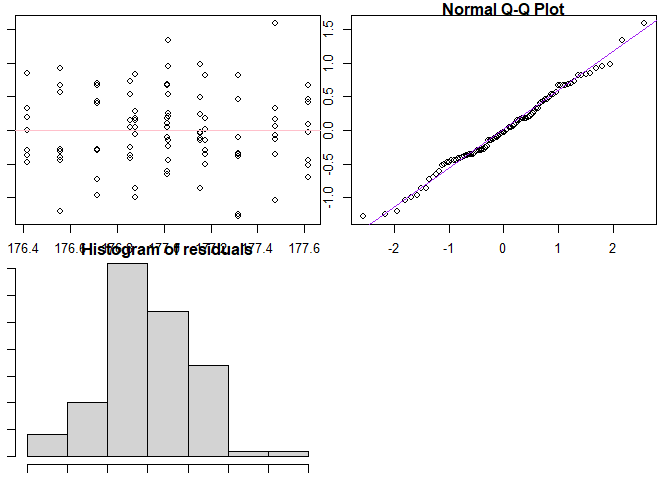

# FinalProjectG4

\[Package Repository:FinalProjectG4\]
(<https://github.com/AU-R-Programming/FinalProjectG4>)

The package name is `FinalProjectG4` and the function used in the
package is called `g4lmfunc`. The function within the package, `our_lm`
can be seen as an alternative of in-built linear regression functions in
`R`.

The user must provide the response and predictors; a significance level
(alpha) is optional and can be changed by the user, but it remains 0.05
by default. `resp` : A vector of length n that represents a dependent
variable we would like to explain/predict. `pred` : A matrix of
dimension nxp; this matrix is an independent variable used to predict
resp and beta.

The package can be downloaded by using the `devtools::install_github`
function. After downloading the package, we need to call the function
`g4lmfunc`. After activating the function, it is ready to use. We apply
our function to the `crop.data.csv` dataset as an example. We take the
yield as response and density, block, and fertilizer as predictors.

    ## $coefficients
    ##           A           B           C           D 
    ## 175.7945747   0.5331131  -0.0711576   0.2995627 
    ## 
    ## $confidence_interval
    ##            conf1        conf2
    ## ones 175.3188818 176.27026769
    ##        0.2751324   0.79109386
    ##       -0.1865301   0.04421489
    ##        0.1582608   0.44086457
    ## 
    ## $R_square
    ## [1] 0.2705565
    ## 
    ## $C_p
    ##          [,1]
    ## [1,] 33.26439
    ## 
    ## $F_stat
    ## [1] 11.3745
    ## 
    ## $p
    ## [1] 2.056203e-06
    ## 
    ## [[7]]
    ## NULL

<!-- -->
