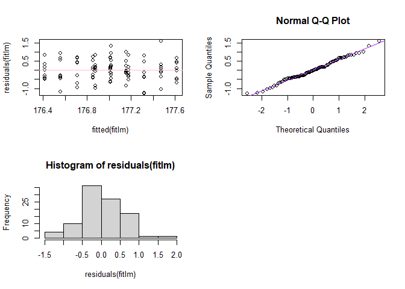

# FinalProjectG4

\[Package Repository:FinalProjectG4\]
(<https://github.com/AU-R-Programming/FinalProjectG4>)

The package can be downloaded by using the `devtools::install_github`
function. After downloading the package, we need to call the function
called `g4lmfunc`. After activating the function it is ready to use. We
will apply our function to the `crop.data.csv` dataset as an example.

Then we apply the `lm` function which is already available in `R`. We
take the yield as response and density, block, fertilizer as predictors.

    ## 
    ## Call:
    ## lm(formula = yield ~ density + block + fertilizer, data = cropdata)
    ## 
    ## Residuals:
    ##      Min       1Q   Median       3Q      Max 
    ## -1.27327 -0.37494 -0.02534  0.41070  1.58604 
    ## 
    ## Coefficients:
    ##              Estimate Std. Error t value Pr(>|t|)    
    ## (Intercept) 175.79457    0.24270 724.314  < 2e-16 ***
    ## density       0.53311    0.13163   4.050 0.000107 ***
    ## block        -0.07116    0.05886  -1.209 0.229823    
    ## fertilizer    0.29956    0.07209   4.155 7.27e-05 ***
    ## ---
    ## Signif. codes:  0 '***' 0.001 '**' 0.01 '*' 0.05 '.' 0.1 ' ' 1
    ## 
    ## Residual standard error: 0.5768 on 92 degrees of freedom
    ## Multiple R-squared:  0.2706, Adjusted R-squared:  0.2468 
    ## F-statistic: 11.37 on 3 and 92 DF,  p-value: 2.056e-06

    ##                   2.5 %       97.5 %
    ## (Intercept) 175.3125408 176.27660678
    ## density       0.2716946   0.79453280
    ## block        -0.1880678   0.04575251
    ## fertilizer    0.1563777   0.44274792

<!-- -->

Now, we apply our function `our_lm` to the same data.
